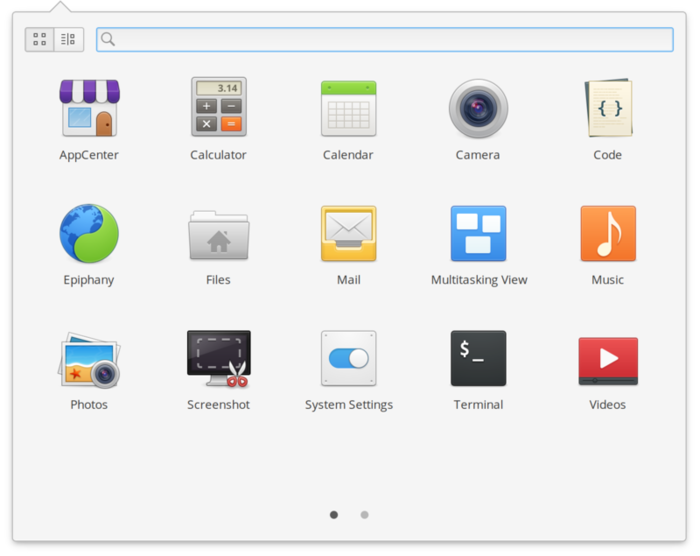
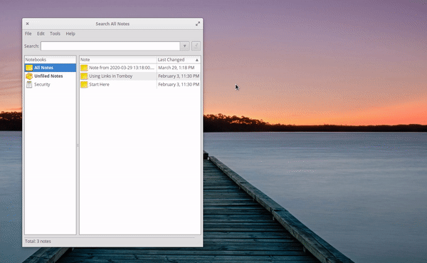
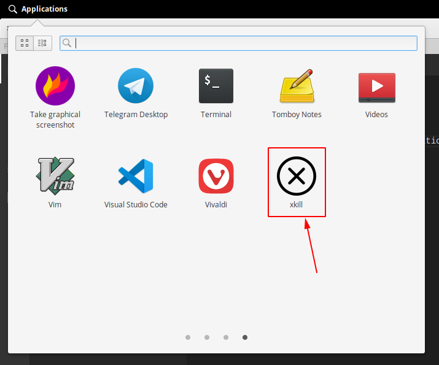
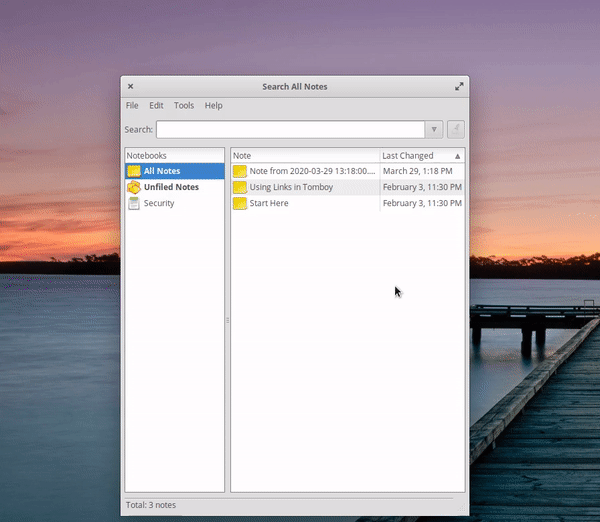
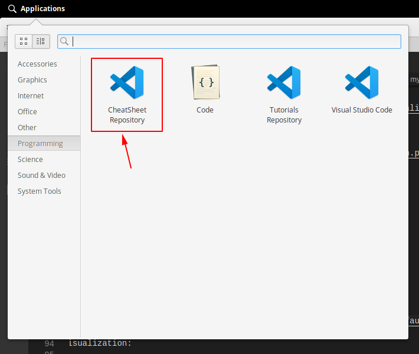

## App Menu

On the upper left corner is the Elementary App Menu. You can open it by clicking on the Application button or pressing `Windows + Space`. The Menu lists all the applications installed which have a `.desktop` file registered. 

<p align="center">
  
</p>

## Problem

Sometimes there are actions that I do in the terminal that I would like to have on hand to save time. One example is the `xkill` command. The scenario will be next:

Let's suppose I'm doing any operation that makes a program stop working, and I want to close it. What I do then is open a terminal and kill the process by introducing the command `xkill` and clicking on the windows I want to force to close.

<p align="center">
  
</p>

Another scenario I have in mind is when I always navigate through the terminal or the file explorer to the same folder just for opening VS Code there. In my case, that folder is my [cheatsheet repository](https://github.com/cangulo/cheatsheet).

<p align="center">
  
</p>

So, how can we improve this process? By creating a custom launcher in the Menu that save us any manual operations we usually do. Let's see that.

## Solution: Create a custom App Launcher

1. Go to the next directory:

`/home/[YOUR_PROFILE_NAME]/.local/share/applications` 

2. Create a `.desktop` file with the app name you want to add. E.g. `xkill.desktop`

3. Paste the next template content:

```bash
[Desktop Entry]
Name=
GenericName=
Comment=
Exec=
Icon=
Type=Application
Categories=
Keywords=
```

There is also a `version` parameter, but it is not needed for our purpose.

4. Replace the template as follows:

| Parameter     | Possible Values                                                                                                         |
| :------------ | :---------------------------------------------------------------------------------------------------------------------- |
| `Name`        | The name to be displayed in the app launcher                                                                            |
| `GenericName` | Use to categorize your app, it should be in title case. e.g. *Markdown Editor*<br>You can use it search in the app menu |
| `Exec`        | Command line command to be executed                                                                                     |
| `Comment`     | Text to be displayed while you hover the pointer over the icon                                                          |
| `Icon`        | Reference to the icon you want to display, you could download it from the app web page or leave it empty                |
| `Type`        | For this article we are going to use `Application`                                                                      |
| `Categories`  | Any of the categories displayed [here](#default-categories-in-elementary)                                               |
| `Keywords`    | List of separate words to search the application in the App Menu. Each word should be separate by `;`.                  |

Next are some command examples that I use in the `Exec` parameter.

| Program to open                          | Example command          |
| :--------------------------------------- | :----------------------- |
| xkill (Close a window by clicking on it) | `xkill`                  |
| VS Code in my repository folder          | `code [Repository Path]` |

## `.desktop` examples

### xkill

#### Code

<!-- CODE_START ./resources/2020-06-07-create-app-shortcut/desktop_files/xkill.desktop  bash -->
```bash
[Desktop Entry]
Name=xkill
GenericName=Bash Command Execution
Exec=xkill
Comment=Execute xkill command, you will be able to close any windows by clicking on it
Icon=/home/carlos/.local/share/applications/customs_app_launchers/system/resources/xkill-icon.svg
Type=Application
Categories=System
Keywords=Command;kill;close
```
<!-- CODE_END -->

<p align="center">
  <a href="./resources/2020-06-07-create-app-shortcut/desktop_files/xkill.desktop"><i>xkill.desktop</i></a>
</p>

*Note: I downloaded the icon from google.*

#### Visualization

<p align="center">
  
</p>

#### Execution

<p align="center">
  
</p>

### Open VS Code in my cheatsheet repository

#### Code

<!-- CODE_START ./resources/2020-06-07-create-app-shortcut/desktop_files/vscode-repo-cheatsheet.desktop  bash -->
```bash
[Desktop Entry]
Name=CheatSheet Repository
GenericName=VS Code custom execution
Exec=code /home/carlos/Documents/github_repositories/cheatsheet
Comment=Open VS Code in my cheatsheet folder
Icon=/home/carlos/.local/share/applications/customs_app_launchers/vs_code_repositories/com.visualstudio.code.png
Type=Application
Categories=Development
Keywords=VScode;VS code;Repository;Repo;cheatsheet
```
<!-- CODE_END -->

<p align="center">
  <a href="./resources/2020-06-07-create-app-shortcut/desktop_files/vscode-repo-cheatsheet.desktop"><i>vscode-repo-cheatsheet.desktop</i></a>
</p>

*Note: I get the icon path from the second folder described [here](#default-app-launcher-files-location-in-elementary). There it was the `code_code.desktop` with the default app launcher information.*

#### Visualization

<p align="center">
  
</p>

#### Execution

<p align="center">
  
</p>

## Summary

As explained before, the process of creating an app shortcut is not complicated. The most crucial step is to know what command should be executed in the `exec` attribute. 

I hope this guide helps you to create your own shortcuts in the Elementary and increase your productivity! Feel free to contact me for doubts :)

## Notes

### Default categories in Elementary

| Category in the .desktop file | Label displayed in the menu |
| :---------------------------- | :-------------------------- |
| Utility                       | Accessories                 |
| Education                     | Education                   |
| Graphics                      | Graphics                    |
| Network                       | Internet                    |
| Office                        | Office                      |
| Other                         | Other                       |
| Programming                   | Development                 |
| AudioVideo                    | Sound & Video               |
| System                        | System tools                |

[Solution: Create a custom App Launcher](#solution-create-a-custom-app-launcher)

### Default App Launcher files location in Elementary

If you want to check the `.desktop` files created by default in Elementary, here they are:

`/usr/share/applications`

And here are the ones for applications installed via Snap:

`/var/lib/snapd/desktop/applications`

[Come back to `.desktop` examples](#desktop-examples)

## References

[Create App Launch, Official Elementary Documentation](https://elementary.io/es/docs/human-interface-guidelines#app-launchers)

[Registered Categories for`.desktop` files](https://specifications.freedesktop.org/menu-spec/latest/apa.html)

[Additional Categories for`.desktop` files](https://specifications.freedesktop.org/menu-spec/latest/apas02.html)