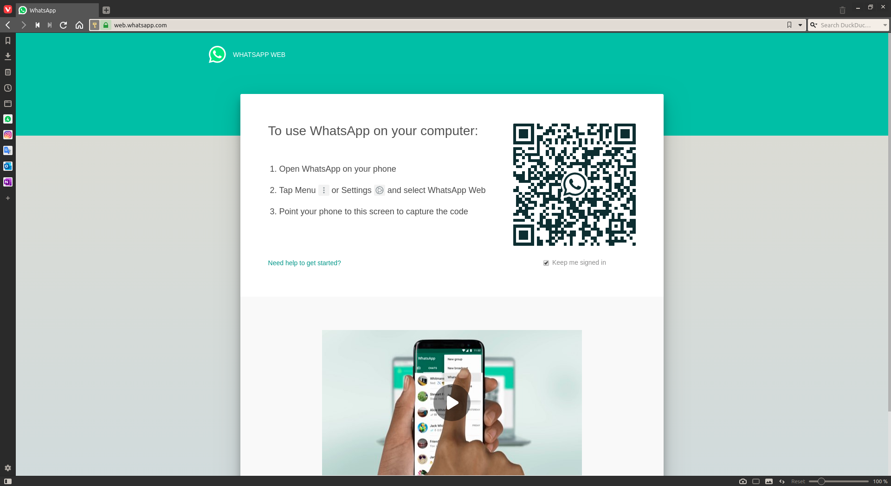
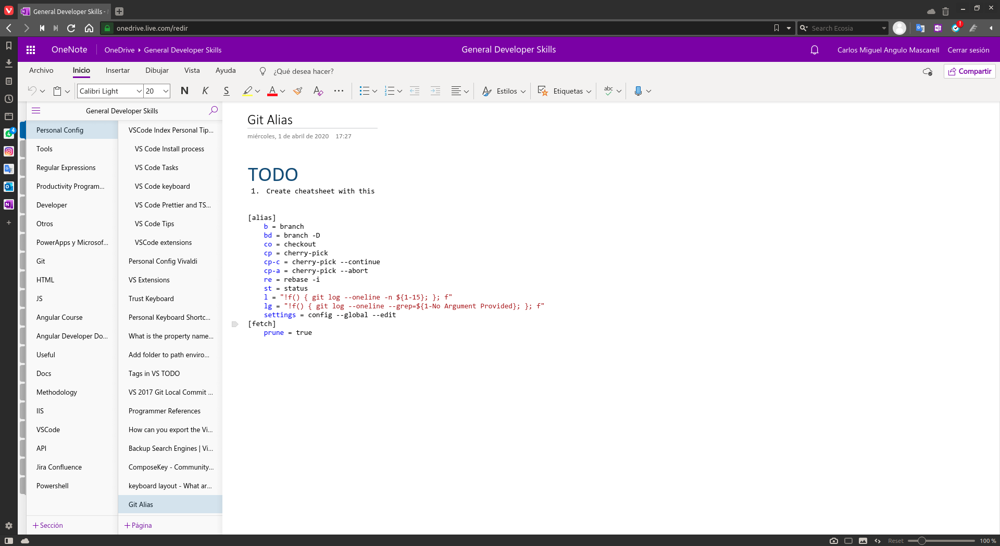
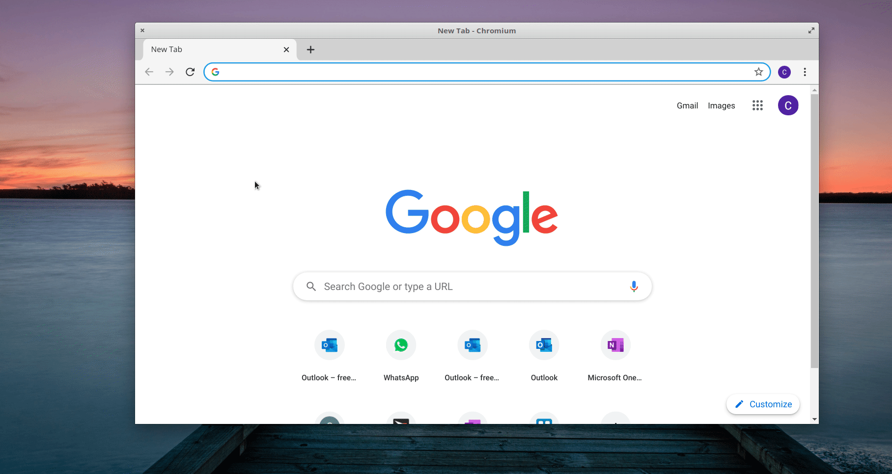
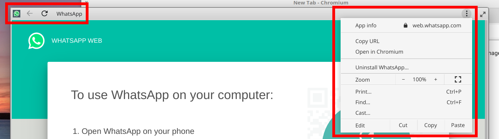
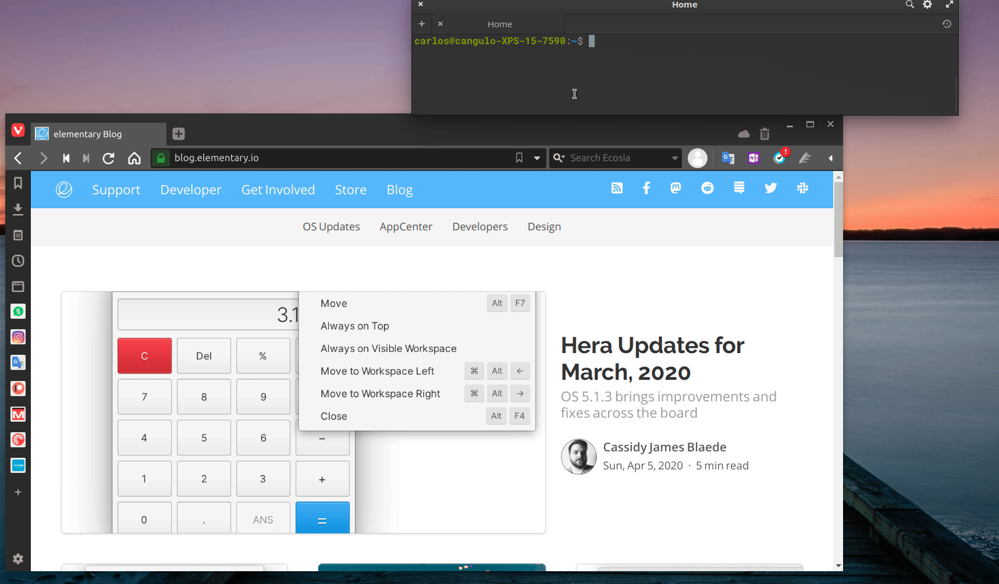

In my [previous article](./2020-06-07-create-app-shortcut.md), I explained how to create an app launcher in Elementary by defining a `.desktop` file with an `exec` property where we code the command to be executed. Here we are going to take advantage of that for creating shortcuts to web pages. 

## Examples

Let's consider the next pages:

### Whatsapp Web

<div align="center">
  
</div>

### Microsoft OneNote

<div align="center">
  
</div>


## Problem

To load the web pages mentioned you have to open the browser and navigate to the urls as next:

<div align="center">
  
</div>
<p></p>

Let's simplify the process with the next solution.

## Solution: Create a web page launcher

### Option 1: Create it using Chromium

[Chromium](https://www.chromium.org) is a open source web browser, its source code is the base of [Chrome](https://www.google.com/chrome), as well as other web browsers such [Opera](https://www.opera.com), [Brave](https://brave.com), [Vivaldi](https://vivaldi.com), or, [recently](https://support.microsoft.com/es-es/help/4501095/download-the-new-microsoft-edge-based-on-chromium), Microsoft Edge. Check this [link](https://www.howtogeek.com/202825/what's-the-difference-between-chromium-and-chrome/) for a more detailed differences between Chrome and Chromium.

So, how can Chromium help us? well, we can create a shortcut for a web page quickly, following the next steps: 

1. Open the web page using Chromium
2. Click in the three dots button for more options
3. Select `More Tools` and  `Create shortcut`
4. Select `Open as Window` to have a UI as a web app, which, will hide all the browser panels as toolbars or buttons.

The previous process and how to open the shortcut is in the next gif:

<div align="center">
  
</div>
<p></p>

The good side is that Chromium creates and configure the shortcut directly in the Elementary App Menu; it even adds the icon!

As a result, you don't have to worry about any `.desktop` file. The downside is that you will have to use Chromium so, if you usually use a different web browser, you would have to provide any login data again. 

One last remark, note the next navigation options are available in the app bar.

<p align="center">
  
</p>

### Option 2:  Using a different web browser

**Please note this section only applies to Chromium-based web browsers, I have tested it with Vivaldi and Brave**

In this option, we will have to create a `.desktop` file as we did in my [previous article](../create_app_shortcut/ReadMe.md) and configure the `exec` property for our web browser. 

#### Whatsapp

Next is an example for the web whatsapp page:

<!-- CODE_START ./resources/2020-06-08-create-webpages-shortcut/desktop_files/web-whatsapp-manual-without-exec bash -->
```bash
[Desktop Entry]
Name=Web Whatsapp
GenericName=Whatsapp Web Interface
# Exec empty for now
Exec=
Comment=Open the Web Whatsapp page
Icon=/home/carlos/.local/share/applications/customs_app_launchers/web_apps/web-whatsapp.png
Type=Application
Categories=Network
Keywords=Whatsapp;Chat;WebWhatsapp;
```
<!-- CODE_END -->

Let's focus on the `exec` field. As we are trying to open a web page we should use the browser command, in my case I Use Vivaldi, and its command is `vivaldi [URL]`. For our case:

```bash
vivaldi https://web.whatsapp.com
```
However, this will open the browser as usual, or if this is already open, it will add a new tab with the URL provided. 

<p align="center">
  
</p>

If you want to open any web page as a web app,  you should set the `[URL]` as an `--app` argument in the command:

```bash
vivaldi --app="https://web.whatsapp.com"
```

The visualization for the Whatsapp page would be:

<p align="center">
  
</p>

<p align="center">
  <i>It is important to remark that with Vivaldi neither Brave, we won't have navigation options in the app bar as with Chromium</i>
</p>


The final `.desktop` file will be:

<!-- CODE_START ./resources/2020-06-08-create-webpages-shortcut/desktop_files/web-whatsapp.desktop bash -->
```bash
[Desktop Entry]
Name=Web Whatsapp
GenericName=Whatsapp Web Interface
Exec=vivaldi --app="https://web.whatsapp.com/"
Comment=Open the Web Whatsapp page in Vivaldi as a web application
Icon=/home/carlos/.local/share/applications/customs_app_launchers/web_apps/web-whatsapp.png
Type=Application
Categories=Network
Keywords=Whatsapp;Chat;WebWhatsapp;
```
<!-- CODE_END -->
<p align="center">
  <a href="./resources/2020-06-08-create-webpages-shortcut/desktop_files/web-whatsapp.desktop"><i>web-whatsapp.desktop</i></a>
</p>

Please copy that file to `/home/[YOUR_PROFILE_NAME]/.local/share/applications` and provide an image for the icon; you should reference it in the `Icon` field.
 
#### OneNote

Next will be the `.desktop` file for OneNote:

<!-- CODE_START ./resources/2020-06-08-create-webpages-shortcut/desktop_files/onenote.desktop bash -->
```bash
[Desktop Entry]
Version=1.0
Terminal=false
Type=Application
Name=Microsoft OneNote
Exec=vivaldi --app="https://www.onenote.com/notebooks"
Icon=/home/carlos/.local/share/applications/customs_app_launchers/web_apps/onenote.png
Categories=Office;
Keywords=Office;Onenote;Notes;Note
```
<!-- CODE_END -->

<p align="center">
  <a href="./resources/2020-06-08-create-webpages-shortcut/desktop_files/onenote.desktop"><i>onenote.desktop</i></a>
</p>

## Summary 

Creating a web page access in the app launcher is a quick process if you don't mind to use Chromium as a browser. In case you want to use a different browser, you can only do it with Chromium-based, by handling  `.desktop` files as explained in this article. In case you are a Firefox user, it seems there is no [easy solution](https://askubuntu.com/questions/487936/how-do-i-open-fixed-window-in-firefox-like-chrome-app-mode).

I hope this guide helps you to create your own shortcuts in the Elementary and increase your productivity! Feel free to contact me for doubts :)

## References

[Create an App Shortcut in Elementary](../create_app_shortcut/ReadMe.md)

[Create a Web App shortcut for Firefox](https://askubuntu.com/questions/487936/how-do-i-open-fixed-window-in-firefox-like-chrome-app-mode)
