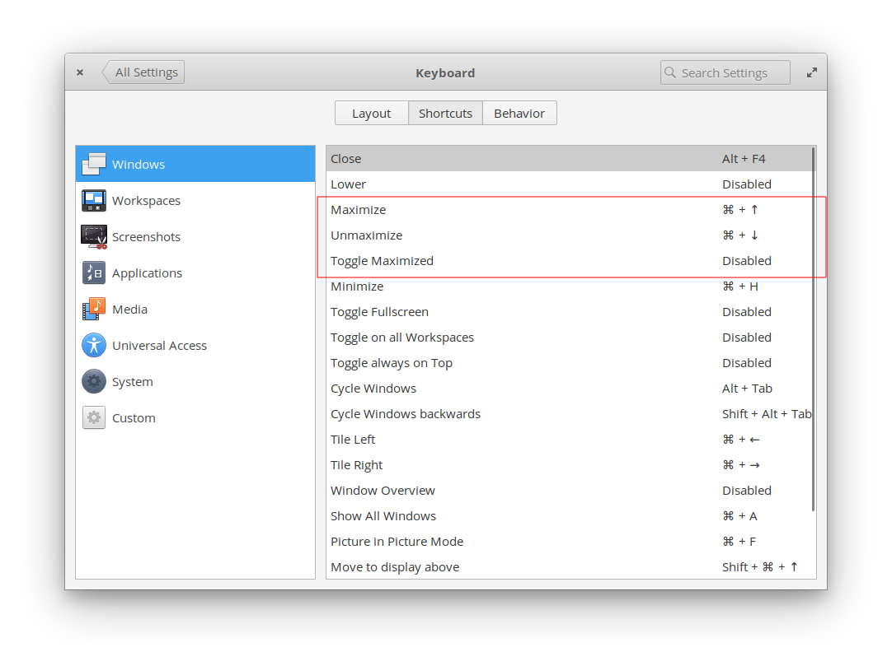

It is a simple process based in [dconf](https://en.wikipedia.org/wiki/Dconf) terminal tool, which is essentially a command line interface to manage all the settings.

## Software used

* `dconf` -> If you don't have it, you can install with `sudo apt install dconf*`
* Elementary Release 5.1.2 (execute `lsb_release -a` to know what version you have)

## Commands CheatSheet


| Command                  | Description                                     |
| ------------------------ | ----------------------------------------------- |
| `dconf reset -f /`       | Restore default Elementary Config               |
| `dconf dump / > [File]`  | Save the current settings to the `[File]` file. |
| `dconf load  / < [File]` | Restore the  settings store in the  `[File]`.   |

## Process to create a backup

I recommend you to create a backup config file with the date concatenated. \
The next bash code create a file called `backup-elementary-` and adds the date in the format `YYYYMMDD`.

```bash
#!/bin/bash
#   Backup Config using dconf

current_date=$(date +%Y%m%d)
dconf dump / >backup-elementary-$current_date
```

<p align="center">
  <a href="https://github.com/cangulo/cheatsheet/blob/master/BashCheatSheet/resources/backup_config_elementary.sh"><i>backup_config_elementary.sh</i></a>
</p>

This is an output file example
```bash
[org/gnome/desktop/wm/keybindings]
maximize=['<Super>Up']
unmaximize=['<Super>Down']
toggle-maximized=['']
```

The previous output described my custom configuration regarding to windows interactions:

<p align="center">
    
</p>

## Process to restore a backup

```bash
# Pleae note *YYYYMMdd* refers to the year month day of the backup 
dconf load / < backup-elementary-YYYYMMdd;
```

## References

[Backup And Restore Linux Desktop System Settings With Dconf](https://www.ostechnix.com/backup-and-restore-linux-desktop-system-settings-with-dconf/)
