<p align="center">
  
</p>

  _This is my first article of the serie VS Code for Documentation. I will explain the Markdown basics through all the publications._


Have you ever opened a file and realize there are so many lines that you need a coffee before start reading? I do, reading tones of code is part of our job as programmers, but sometimes one paragraph with some description could have saved us hours! The problem is we have so much work that we tend to see documentation as something that requires time we don't have.  

We can't create time, but we can try to use it better by becoming more productive when documenting, what if instead of open a word document or create a new page in Confluence page you could start documenting without closing the IDE you use? I learn to do it by combining VS Code and Markdown. Let's dive into it:

## Markdown

MD is a plain text format for writing structured documents. It is based on a specific markup syntax which is directly rendered to HTML. Its main focus is on making readable documents as possible. The defined file extension for Markdown is _.md_.

### Syntax

The following list presents the MD examples we will use in this document and how they are rendered in HTML:

<p align="center">
  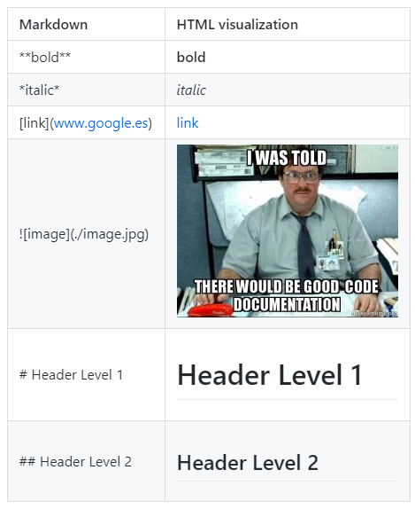
</p>

The number of hashtags wrote defines the heading level. Thee maximum accepted is 6 and any higher number will be rendered as plain text to HTML. Why is this? Well, each heading level in MD is translated to an HTML heading tag, as the defined there are from <h1\> until <h6\>, there is no equivalent for higher levels.

### How is it used?

All source code systems, like _GitLab_ or _Bitbucket_, support MD files. Have you ever notice _GitHub_ always offers you to include a README (file) when creating a repository?

<p align="center">
  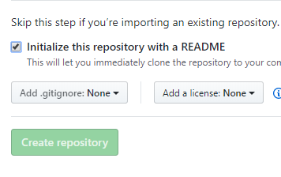
</p>

It is referring the _Readme.md_ file that is used to describe the repository. As it is Markdown, it will be rendered to HTML directly when you open the repository URL in Github. Next is an example extracted from my personal [Cheatsheet repository](https://github.com/cangulo/cheatsheet):  

<p align="center">
  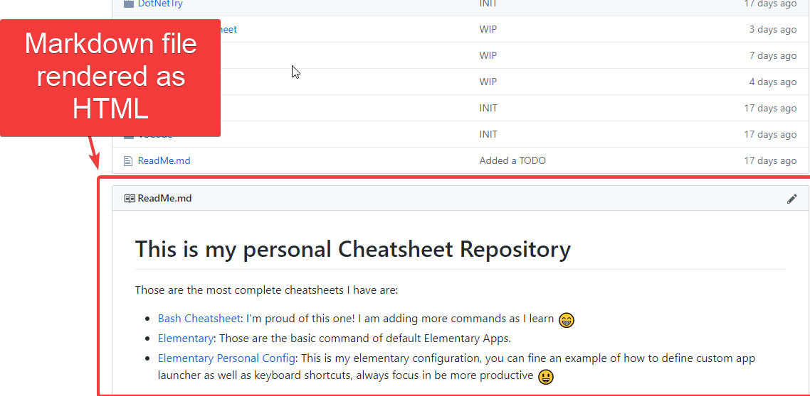
</p>

If I click in the edit button on the right, the MD code-behind will be displayed:

<p align="center">
  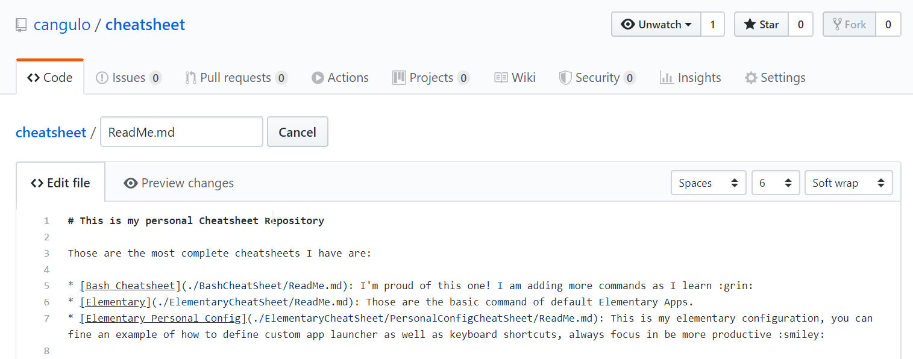
</p>

Any file called _Readme.md_ located in any folder will be rendered when that folder is open. Any other MD file should be clicked to be displayed as HTML.

In contrast to [_WYSIWYG_](https://en.wikipedia.org/wiki/WYSIWYG)(What You See Is What You Get) tools, like _Microsoft Word_ or any Content Management System (CMS), MD depends only in what you write, not in any UI option you click to format text. Let's check the pros and cons:

### Advantages

* **Easy!** The learning curve is short, less than 15 minutes to read any cheatsheet like [this](https://guides.github.com/features/mastering-markdown/)
* **Large community**: All big platforms as _GitHub_, _GitLab_ and _Bitbucket_, support it by default
* Known IDEs as _VS Code_ or _Atom_ support it
* If the files are stored in a code repository, **modifications are tracked** as code changes (we will see this in the next articles)
* It fits for small teams, release notes and descriptions with images and gifs

### Disadvantages

* **Not adaptable**, by default, **for extensive documentation solutions**. To use a CMS, like [_Confluence_](https://www.atlassian.com/es/software/confluence), is a much better approach. It is like comparing a set of articles written in _WordPad_ vs a _Confluence_ structured documentation
* **Lack of functionalities**. If you create a set of MD files, by default, you won't be able to relate them with tags, as you could do using a CMS. Neither configures localization to offer them in different languages
* **Portability**. Markdown defines a basic syntax which has been extended by specific implementations (i.e. [flavors](https://github.com/commonmark/commonmark-spec/wiki/markdown-flavors)). Each one has syntax extensions that bring improvements, and if you use them you became dependent on that flavor and files migration could result in [losing features](https://www.ericholscher.com/blog/2016/mar/15/dont-use-markdown-for-technical-docs/#flavors)

> _The Markdown implementation used in this and next articles is [CommonMark](https://commonmark.org/); VS Code supports it by default, and GitHub flavor (GFM) is based on it._

* You have to **embed HTML** if you need customization outside the basic features, e.g. to align images to the centre or to [define two columns](https://stackoverflow.com/questions/30514408/have-two-columns-in-markdown)

I would like to remark the _by default_ mention in the disadvantages. Markdown is focussed only in the document content, not in files management functionalities as CMS.

However, there are packages, as [Jekyll](https://jekyllrb.com/), that has solved that problem by creating static web sites from MD files and providing some CMS functionalities. GitHub offers [Github Pages](https://pages.github.com/), a free web hosting service which supports those packages; in fact, it is highly extended among developers for blogging. It is important to mention a background in HTML, JS and version control is required to use them. Furthermore, functionalities not supported, as search, should be developed _ad hoc_ or using plugins.

> _There are [other markup languages](https://github.com/github/markup#markups) to be considered when creating documentation, but it is out of this article scope._

## First steps in VS Code

Let's start with the next document, it uses the MD syntax mentioned at the beginning:
    
```markdown
# Header 1

Lorem ipsum dolor sit amet, consectetur adipiscing elit. 

## Header 2

words in *italic* and **bold**

**Images**


**Links**

[Link to the image](https://media.makeameme.org/created/i-was-told-i1zn4b.jpg)
```

Paste it in a new MD file in VS:

<p align="center">
  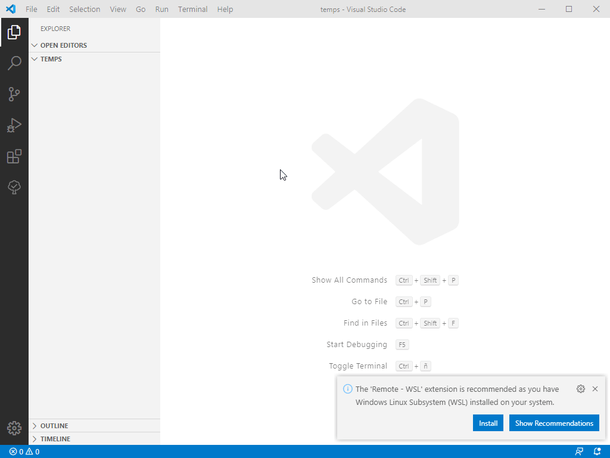
</p>

Let's see in practice the main out of the box features with that file:

* **Markdown File Preview**: By clicking in the next icon, in the top right, a preview of the current file will be opened to the right.

<p align="center">
  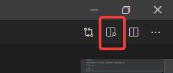
</p>

<p align="center">
  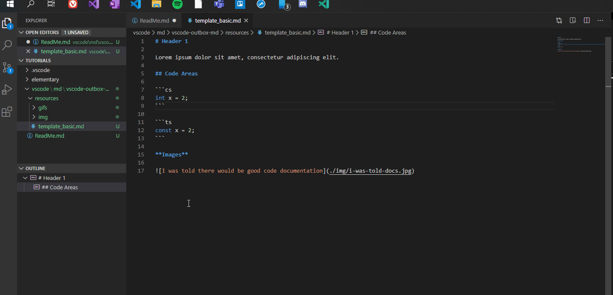
</p>

The preview is updated as you type. You can also open the preview by pressing _Ctrl+Shift+v / Ctrl + k, v. T_he command _Markdown: Open Preview to the Side_ is also available in the Command Palette, for that use _Ctrl+Shift+p_, type part of the name until it is selected and press _Enter_.  

<p align="center">
  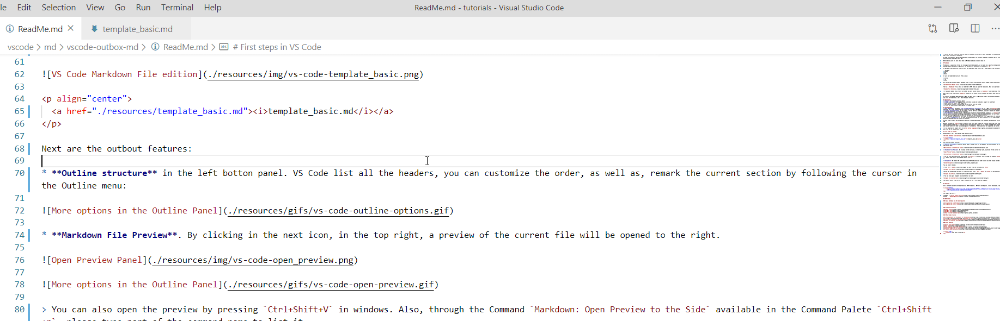
</p>

* **File structure listed** in the _OUTLINE_ panel. In order to facilitate navigation, VS Code list all the headers in the mentioned panel, by clicking in any of then the cursor will be located at the end of the line where the header is located. The customization options are: change the order how are listed, and remark the section where the cursor is located:

<p align="center">
  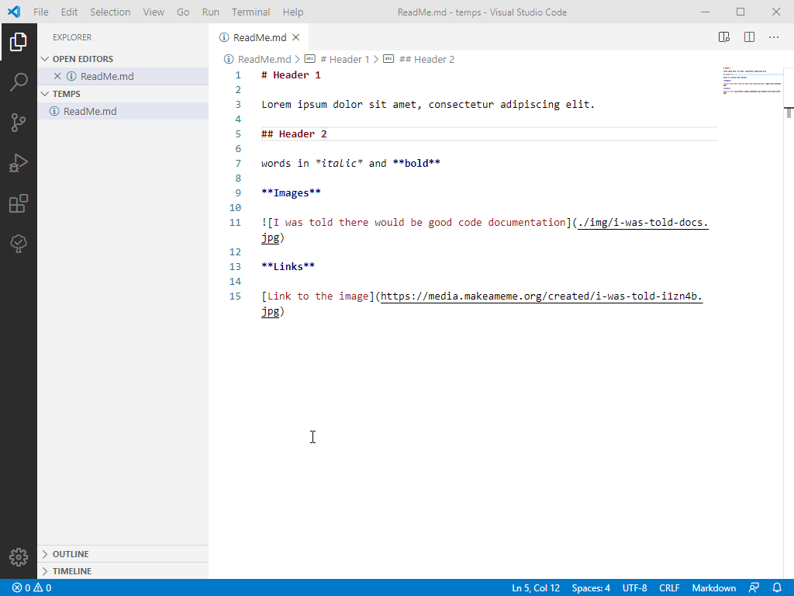
</p>

* **Code Navigation through symbols**: VS Code considers headers entries as symbols, this allows us to navigate to them in the Command Palette using the [_Go to Symbol_](https://code.visualstudio.com/Docs/editor/editingevolved#_go-to-symbol) command, the keyboard shortcut is _Ctrl + Shift + o._

<p align="center">
  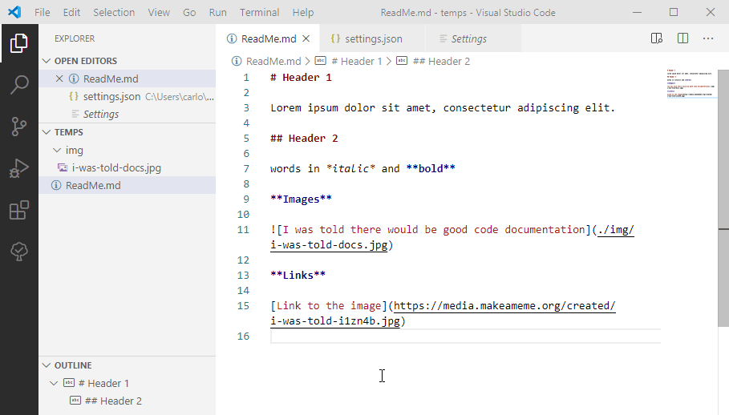
</p>

The [breadcrumb ](https://code.visualstudio.com/docs/getstarted/userinterface#_breadcrumbs)(navigation bar about the content) is also an option to navigate through the document.

* **Snippets**: VS Code offers you the next list of predefined pieces of code to save you time typing called snippets:

<p align="center">
  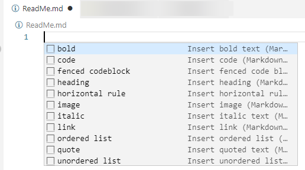
</p>

You can insert them by:

1. Press _Ctrl + Space_, select the snippet you want from the list and press _Enter_


<p align="center">
  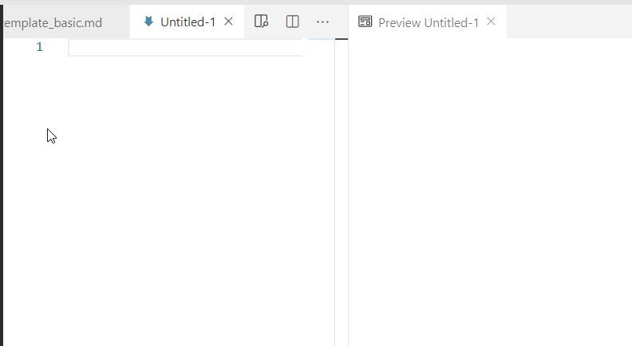
</p>

Please note you can navigate the list with the arrow keys and up/down pages key. If the snippets are not at the beginning, they will be at the end of the list. This is because all the other words in the document will be listed in the list as word snippets.

2. Write the snippet name you want, or a partial part, press _Ctrl + Space_ and _Enter_ in the one you want to insert

<p align="center">
  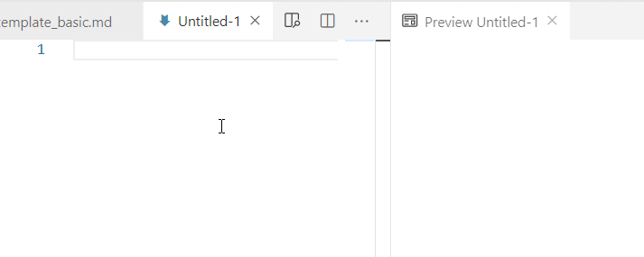
</p>

3. You can also apply snippets to any selected text as next:

<p align="center">
  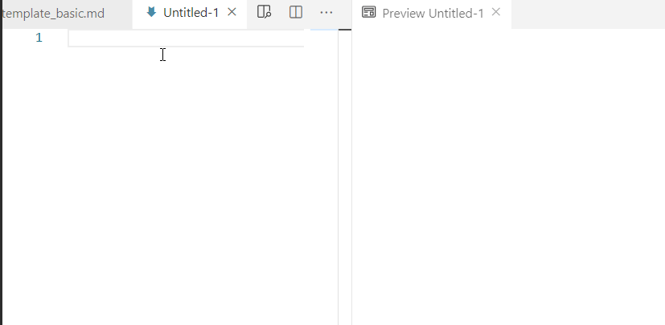
</p>

You have to select from left to right; otherwise, VS won't offer you the snippets.

> _Have you notice the grey areas marked when a snippet is inserted? Those are areas you can navigate through, forward with the tab key and backward shift + tab._

In the next articles, I will explain how to create custom snippets which can be useful to define markdown document templates.

## Final Notes

I think the learning curve for Markdown is short enough to give it a try, documenting personal projects is simpler and more comfortable than any other alternative. What I most value is the fact I can program and document on the same IDE, and as the MD files are tracked with git, I can verify the documentation changes as they were code in VS Code.

For companies, CMS software is still a better approach because all the functionalities included. Although a custom solution using static web sites generator is also viable, Jekyll has some interesting [showcases](https://jekyllrb.com/showcase/) as [Spotify](https://jekyllrb.com/showcase/).

All the out of the box features of VS Code has been enough to write this article directly in Markdown. You can visualize the result [here](https://github.com/cangulo/cangulo.github.io/blob/dev/src/markdown-pages/vscode/md/1-vscode-md-outbox/1-vscode-md-outbox.md). There is a list of extensions available that will help us to increase our productivity, but I will explain it in the next article.

## References

### Basic Markdown and VS Code required

[Getting Started with Markdown](https://www.markdownguide.org/getting-started/)  
[Getting Started with VS Code](https://code.visualstudio.com/docs/introvideos/basics)


### Markdown References

[Markdown Flavors](https://github.com/commonmark/commonmark-spec/wiki/markdown-flavors)  
[CommonMark spec](https://spec.commonmark.org)  
[CommonMark docs](https://commonmark.org)  
[GitHub Flavored Markdown Spec](https://github.github.com/gfm/)

### **Must-read articles**

[Why You Shouldn’t Use “Markdown” for Documentation](https://www.ericholscher.com/blog/2016/mar/15/dont-use-markdown-for-technical-docs/). Wrote by the founder of [Write the Docs](https://www.writethedocs.org) and [Read the Docs](https://www.writethedocs.org), it explains his opinion about using Markdown for TW in 2016.  
[Why You Should and Should Not Use Markdown](https://medium.com/@stymied/why-you-should-and-should-not-use-markdown-1b9d70987792)  
[Markdown in Technical Writing](https://medium.com/technical-writing-is-easy/markdown-in-technical-writing-96e818816be9)  

### Other References

[jekyllrb tags feature](https://jekyllrb.com/docs/posts/#categories-and-tags)  
[Github Pages](https://pages.github.com)  
[Markup languages supported by GitHub](https://github.com/github/markup#markups)  
[CommonMark support by VS Code](https://code.visualstudio.com/docs/languages/markdown#_does-vs-code-support-github-flavored-markdown)  
[VS Code Markdown documentation](https://code.visualstudio.com/docs/languages/markdown)  
