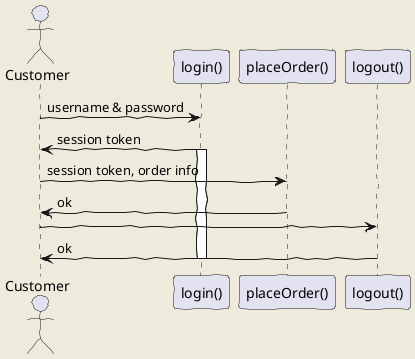

# Third Idea

> This is my third article of Using Vs Code for Markdown file series, a basic knowledges of Markdown and VS Code is required. If you don't have it, please refer to links at the end of this article for references.

VS Code is a powerfull IDE for programing C#, python and a lot of other languages. Markdown (md) is also in the list, however,  sometimes people is not aware of all the outbox functionalities offered by this IDE. 

Before diving into it, lets check what is Markdown and why we should know it.

## How are defined

## My custom Snippets

1. Insert Centered Image
2. Insert Caption for Code area
3. About Me area
4. Back to top
5. Markdown Template

## Final Notes

---

# Fourth Idea

## uml: sequence diagram
Here I will embed PlantUML markup to generate a sequence diagram.

I can include as many plantuml segments as I want in my Markdown, and the diagrams can be of any type supported by PlantUML.

## Refences

[How to edit Markdown + UML in Visual Studio Code
](https://www.freecodecamp.org/news/inserting-uml-in-markdown-using-vscode/)  