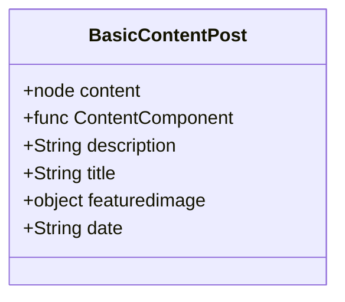

Concepts:

* Cheatsheet: A quick reference page where I use
* Meetups
* Blog
* Templates: `.js` files that structure pages using components.
  * File Name Patterns:`name-type.js` --> type: page,post
  * Class Name Patterns: `NameType`
* Components: `.js` files which encapsulate handle page areas as Header, Footer or markdown content. 
  * File Name Patterns:`Name.js`
  * Class Name Patterns: `Name`

Templates Folder:

* Template is something is mapped directly to a .md file or an index page

| File Name     | Class Contained             | Description                             |
| ------------- | --------------------------- | --------------------------------------- |
| post.js       | BasicPost                   | Web page model for all post (.md files) |
| index-page.js | IndexPage,IndexPageTemplate | Initial page content, '/'               |

Components Folder:
* Is something that is been used in Templates

<!-- TODO: Rename blog-post-list to BlogPostIndex.js -->

| File Name                                                        | Class Contained | Description                                                                         |
| ---------------------------------------------------------------- | --------------- | ----------------------------------------------------------------------------------- |
| [MeetupRoll.js](../../../components/rolls/MeetupRoll.js)         | MeetupRoll      | Roll of Meetups used by [pages/meetups/index.js](../../meetups/index.js)            |
| [CheatsheetRoll.js](../../../components/rolls/CheatsheetRoll.js) | CheatsheetRoll  | Roll of Cheatsheets used by [pages/cheatsheets/index.js](../../cheatsheet/index.js) |
| [BlogRoll2.js](../../../components/rolls/BlogRoll2.js)           | BlogRoll2       | Roll of Articles used by [blog-posts-list.js](../../../templates/index-articles.js) |


How I structure that into code:



```mermaid
graph LR
    Blog Roll --> Basic Post
    Cheatsheet Roll --> Basic Post
    Meetup Roll --> Basic Post
```
