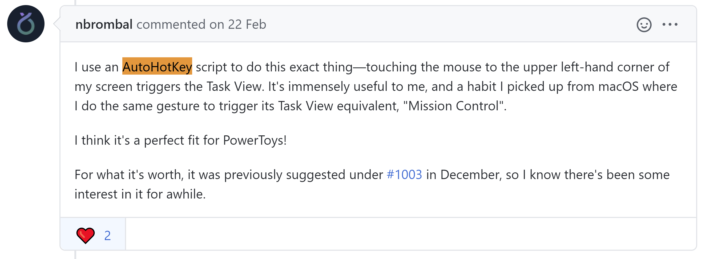
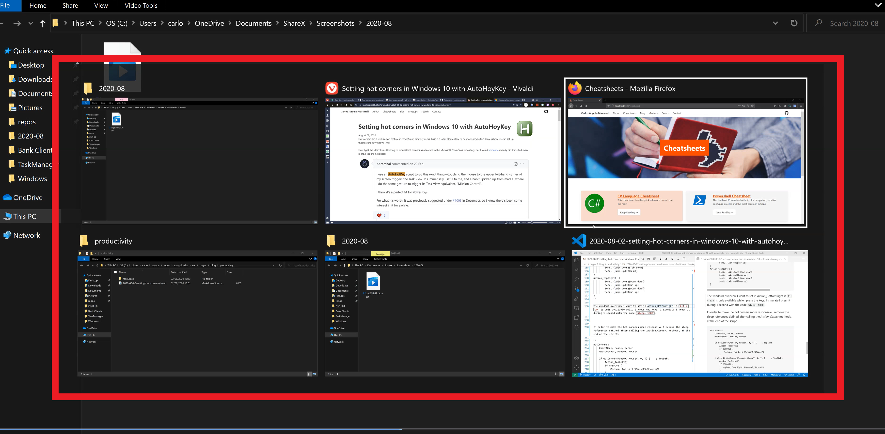
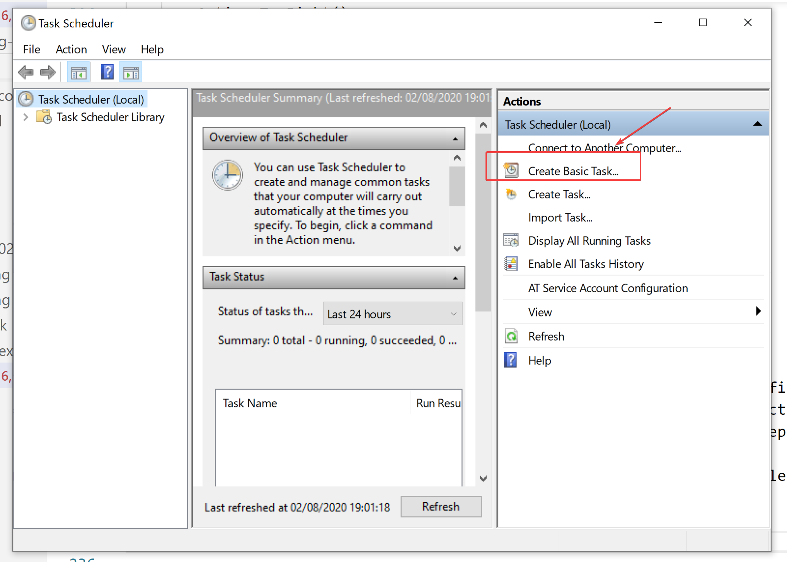
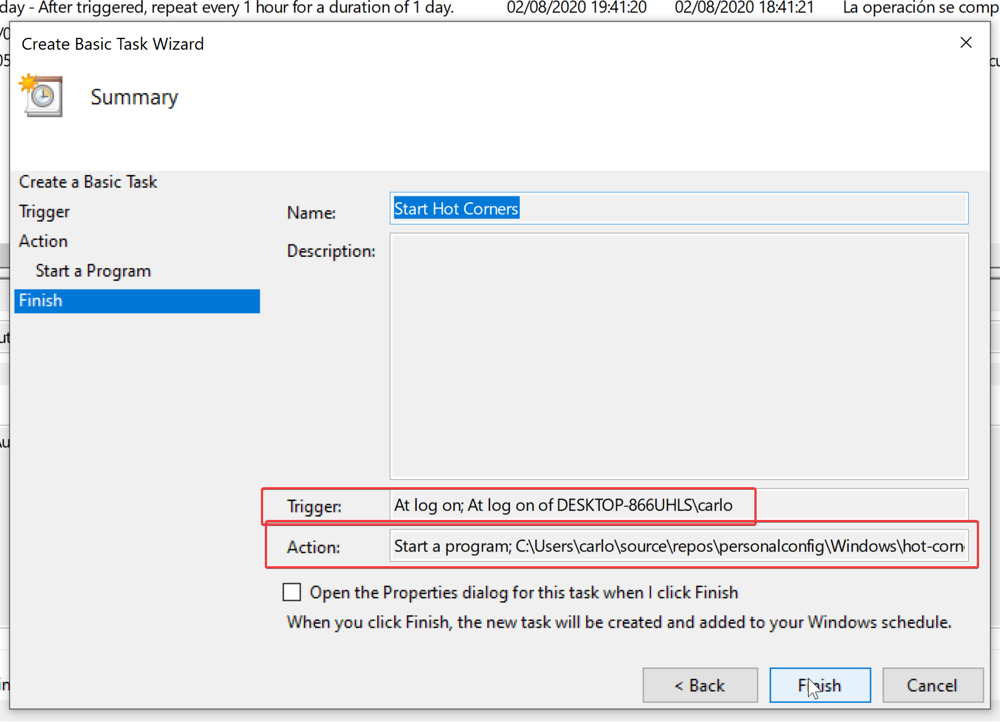
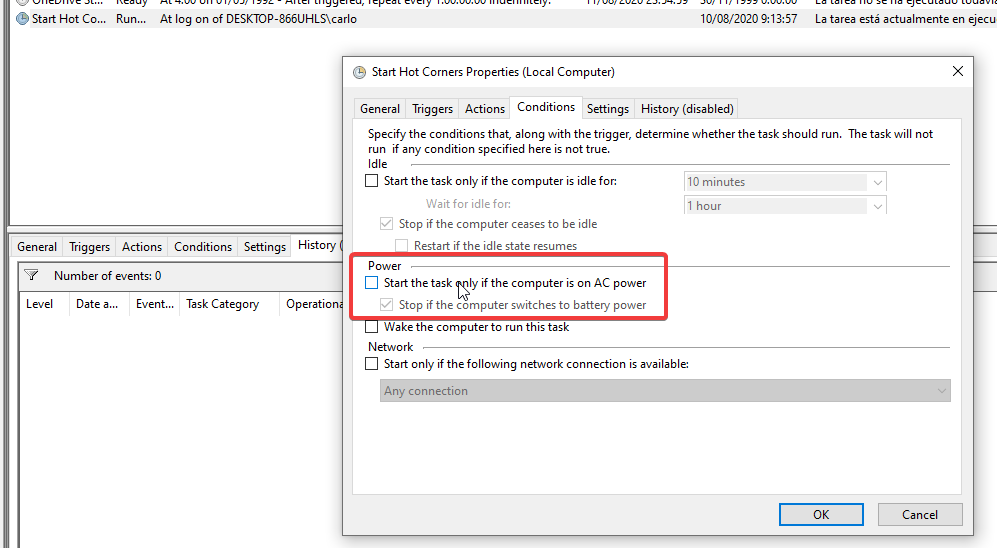

How I get the idea? I was thinking to request hot corners as a feature in the Microsoft PowerToys repository, but I found [someone](https://github.com/microsoft/PowerToys/issues/1305) already did that. And even more, I see the next hack:



Simple, use [AutoHotkey](https://www.autohotkey.com) as a temporal workaround! Wait, but what is AutoHoyKey? It is an automation script language for windows that we can use to map actions with specific key bindings, those scripts have the `ahk` extension. Here are some [examples](https://www.maketecheasier.com/favorite-autohotkey-scripts/).

I proceed to investigate what other people achieve using it, and I found the perfect file to start working with:

```bash
#Persistent

; The following script can define hotcorners for any number of monitors arranged in any configuration.
; Horizontally arranged monitors work best
; Vertically arranged monitors may have some difficulty (read: over sensitivity since moving your mouse too far up puts it into Bottom*, not Top*), but should still work


; ---------------------------------------
; USER CONFIGURABLE
; ---------------------------------------
global T = 5   ; Adjust tolerance if needed
global DEBUG := False

; Put your hotcorner actions here
Action_TopLeft() {
        Send, {LWin down}{Tab down}
        Send, {Lwin up}{Tab up}
}
Action_BottomRight() {

}
Action_BottomLeft() {

}
Action_TopRight() {

}

; ---------------------------------
; SETUP
; ---------------------------------

global ScreenArray := Object()

; Get the number of monitors
SysGet, NumMonitors, MonitorCount

; Insert a new empty array for each monitor
Loop %NumMonitors% {
        ScreenArray.Insert(Object())
}

; For each monitor, get the dimensions as coordinates
for index, element in ScreenArray
{
        ; get monitor details for this index (These are 1 based indexes)
        SysGet, Mon, Monitor, %index%
        element.Insert(MonLeft)
        element.Insert(MonTop)
        element.Insert(MonRight)
        element.insert(MonBottom)
}

GetCorner(x, y, cornerIndex, tolerance)
{
    ; loop through each monitor
    for idx, elem in ScreenArray
    {
        if (cornerIndex == 0) { ; Top Left
            ; If statements are so it doesn't break the for loop on the first false. It will only return if true
            if (x >= elem[1] and x <= elem[1] + tolerance) and (y >= elem[2] and y <= elem[2] + tolerance) {
                return True
            }
        } else if (cornerIndex == 1) { ; Top Right
            if (x >= elem[3] - tolerance and x <= elem[3]) and (y >= elem[2] and y <= elem[2] + tolerance) {
                return True
            }
        } else if (cornerIndex == 2) { ; Bottom Right
            if (x >= elem[3] - tolerance and x <= elem[3]) and (y >= elem[4] - tolerance and y <= elem[4]) {
                return True
            }
        } else { ; Bottom Left
            if (x >= elem[1] and x <= elem[1] + tolerance) and (y >= elem[4] - tolerance and y <= elem[4]) {
                return True
            }
        }
    }
}

; --------------------------
; MOUSE DETECTION LOOP
; --------------------------

SetTimer, HotCorners, 500
return

HotCorners:
    CoordMode, Mouse, Screen
    MouseGetPos, MouseX, MouseY

    if GetCorner(MouseX, MouseY, 0, T) {    ; TopLeft
        Action_TopLeft()
        Sleep, 1000
        if (DEBUG) {
            Msgbox, Top Left %MouseX%,%MouseY%
        }
    } else if GetCorner(MouseX, MouseY, 1, T) {     ; TopRight
        Action_TopRight()
        Sleep, 1000
        if (DEBUG) {
           Msgbox, Top Right %MouseX%,%MouseY%
        }
    } else if GetCorner(MouseX, MouseY, 3, T) {     ; BottomLeft
        Action_BottomLeft()
        Sleep, 1000
        if (DEBUG) {
            Msgbox, Bottom Left %MouseX%,%MouseY%
        }
    } else if GetCorner(MouseX, MouseY, 2, T) {     ; BottomRight
        Action_BottomRight()
        Sleep, 1000
        if (DEBUG) {
            Msgbox, Bottom Right %MouseX%, %MouseY%
        }
    }
```

<p align="center">
  <i>
    Thanks Abraham White for this
    <a href="https://gist.github.com/WhiteAbeLincoln"> file</a>
  </i>
</p>

The script does not seem complicated, the methods I should code are _Action_TopLeft_, _Action_BottomRight_, _Action_BottomLeft_ and _Action_TopRight_. So, I proceed to install AutoHotKey v1.1.33.

We have the _Action_TopLeft_ method as an example, it is clear enough to have an idea of how to define the key binding:

```bash
Action_TopLeft() {
        Send, {LWin down}{Tab down}
        Send, {Lwin up}{Tab up}
}
```

- Send,{KEY*1 down}{KEY*2 down} --> down\* refers to pressing the key
- Send,{KEY*1 up}{KEY*2 down} --> up\* refers to releasing the key

Then, the functions I want for each corner are:

| Corner       | Function                                | Keyboard combination | Action Method        |
| ------------ | --------------------------------------- | -------------------- | -------------------- |
| Top Right    | Minimize the current windows            | `Win + Down` twice   | `Action_TopRight`    |
| Top Left     | Open the Windows menu                   | `Win`                | `Action_TopLeft`     |
| Bottom Right | Windows Overview in the current windows | `Alt + Tab`          | `Action_BottomRight` |
| Bottom Left  | Desktops Overviews                      | `Win + Tab`          | `Action_BottomLeft`  |

By checking the [list of keys](https://www.autohotkey.com/docs/KeyList.htm) available, I was able to fill all the methods as I need. However, the `Win + Down` combination of the `Action_TopRight` method, was not the best option because the first press makes the windows smaller (restore it), and the second one minimizes it. As a result, if you open the windows again, it will never be maximized. I found the perfect solution in the [WinMinimize](https://www.autohotkey.com/docs/commands/WinMinimize.htm) function.

```bash
Action_TopLeft() {
        Send, {LWin down}
        Send, {Lwin up}
}
Action_BottomRight() {
        Send, {Alt down}{Tab down}
        Sleep, 1000   --> This is the time I have to choose a windows before the overview dissapears
        Send, {Alt up}{Tab up}
}
Action_BottomLeft() {
        Send, {LWin down}{Tab down}
        Send, {Lwin up}{Tab up}
}
Action_TopRight() {
        WinMinimize, A
}
```

Just one remark, the `Alt + Tab` combination, which activates the Windows Overview, only works while we press the keys, in order to simulate it during 1 second I add the code `Sleep, 1000`.



In order to make the hot corners more responsive I remove the sleep references (`Sleep, 1000`) defined after calling the _Action_Corner_ methods, at the end of the script:

```bash
HotCorners:
    CoordMode, Mouse, Screen
    MouseGetPos, MouseX, MouseY

    if GetCorner(MouseX, MouseY, 0, T) {    ; TopLeft
        Action_TopLeft()
        if (DEBUG) {
            Msgbox, Top Left %MouseX%,%MouseY%
        }
    } else if GetCorner(MouseX, MouseY, 1, T) {     ; TopRight
        Action_TopRight()
        if (DEBUG) {
           Msgbox, Top Right %MouseX%,%MouseY%
        }
    } else if GetCorner(MouseX, MouseY, 3, T) {     ; BottomLeft
        Action_BottomLeft()
        if (DEBUG) {
            Msgbox, Bottom Left %MouseX%,%MouseY%
        }
    } else if GetCorner(MouseX, MouseY, 2, T) {     ; BottomRight
        Action_BottomRight()
        if (DEBUG) {
            Msgbox, Bottom Right %MouseX%, %MouseY%
        }
    }
```

[Here](./resources/2020-08-02-setting-hot-corners-in-windows-10-with-autohoykey/hot-corners-w10.ahk) is the result file, we have to compile it to generate a `.exe` file. For that, right-click on the `ahk` file and select _Compile Script_. Click on the generated file to activate the hot corners. if you found it goes faster than you expected, keep the sleep lines I mention before.

The last step is to create a Task in Windows 10 to execute the `.exe` file when we log in. This is simpler, just open the Task Scheduler app and select _Create a Basic Task_:



Follow the steps and make sure to select `When I log on` as a trigger option, and to provide the `.exe` file in the script field. The Summary view should look like:



Them, the last step is to make sure the task will be executed always no matter some default conditions Windows set up by default. Please Select the task we just created, right click on it, open _Properties_ and go to the _Conditions_ tab. Make sure the next checkbox is unselected:



Perfect, we are ready. Restart your computer and verify it works.

I hope this post helps you to customize even more your computer. Have you used AutoHotKey before? Do you have any other scenario to automatize? Feel free to leave it on the comments or contact me.
