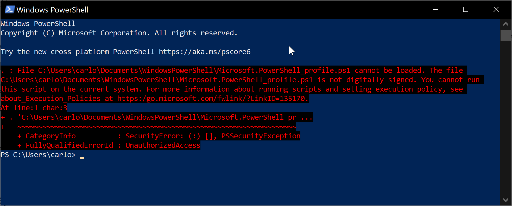

---
title: How to use the PowerShell Profile to be more productive
date: 2020-08-24T13:17:38.760Z
description: In this post, I will explain how to set up shortcuts in the PowerShell Profile. This is useful to save time when we are executing routine actions like moving to one directory or running a script with a long path. Everything in this article works for PowerShell 5.1 and later. 
img: ./resources/powershell-logo.png
tags:
- windows10
- productivity
- hack
- powershell
references:
- ['PowerShell Profiles Reference for PS 5.1','https://docs.microsoft.com/en-us/powershell/module/microsoft.powershell.core/about/about_profiles?view=powershell-5.1']
- ['Profiles Files in PS 5.1','https://docs.microsoft.com/en-us/powershell/module/microsoft.powershell.core/about/about_profiles?view=powershell-5.1#the-profile-files']
- ['Example 4: Create an alias to an executable file','https://docs.microsoft.com/en-us/powershell/module/microsoft.powershell.utility/set-alias?view=powershell-5.1#example-4--create-an-alias-to-an-executable-file']
- ['Example 5: Create an alias for a command with parameters','https://docs.microsoft.com/en-us/powershell/module/microsoft.powershell.utility/set-alias?view=powershell-5.1#example-4--create-an-alias-to-an-executable-file']
- ['How to sign PowerShell profile w/ self-signed certificate?','https://www.tenforums.com/general-support/107659-how-sign-powershell-profile-w-self-signed-certificate.html']
- ['Signing PowerShell Scripts','https://www.hanselman.com/blog/SigningPowerShellScripts.aspx']
--- 

<AlertRender type="info">Hello from the mdx component</AlertRender>

If you are a PowerShell (a.k.a. PS) user, I'm sure at some point you repeat some operations as to navigate to a specific folder once a day (e.g. your local GitHub repository). Maybe you run a script to clean or prepare your environment. Let's define those two scenarios as next:

1. Go to your local git repository folder.
	* Code to execute: `cd .\source\repos\`
2. Execute a script.
	* Code to execute: `$HOME\source\repos\TaskManager\startTaskManagerScript.ps1`

# What is the PS Profile?

The PS Profile is a script that is run when the console starts, and it is used to set custom user settings as variables, alias or functions. We can also use it to execute custom commands to prepare our local environment.

There are different profiles levels, each one with one file and a different combination of user (current or all) and host (current or all) to be applied. To keep this post simple, we are only going to focus on the profile for the _Current User_ and _Current Host_. Please check the [reference](#references) section at the end for more details.

Check your  `$Profile` variable to know where your profile is stored. 


<CaptionRender label="Profile variables"/>

# Shortcuts

The shortcuts we are going to set are functions or aliases depending on the following situations:
1. If we want to create a shortcut for a command with a set of parameters, we will write a function. For example, `goToCustomName` as a shortcut for `cd [PATH]`. The code will be:
	*  `function goToCustomName { cd [PATH] }`

2. If we want to create a shortcut for a command that we use regularly, but with different parameters, we will define an alias. For example, instead of writing `Select-String`, we can write `ss`. In our case, the command is a script we execute, and we want to avoid writing the full path, for that we will use the next code:
	*  `New-Alias -Name [SCRIPT-ALIAS] -Value [SCRIPT-FULL-PATH]`

## Creating the profile
 
 Let's create and open the script file using VS Code by executing the next command in PS: `code $PROFILE`, you should see the code editor empty.

Next are the shortcuts we want to add:

| shortcut              | type     | full command                                                |
| --------------------- | -------- | ----------------------------------------------------------- |
| `goToRepos`           | function | `cd $HOME\source\repos`                                     |
| `startTaskManagerAPI` | alias    | `$HOME\source\repos\TaskManager\startTaskManagerScript.ps1` |

But, as both commands share the `$HOME\source\repos` path, we could define a variable to make them shorter. Here is the table updated:

| shortcut              | type     | full command                                                                                   |
| --------------------- | -------- | ---------------------------------------------------------------------------------------------- |
| `localrepo`           | variable | `$HOME + '\source\repos'`                                                                      |
| `goToRepos`           | function | `function goToRepos { cd $localRepo }`                                                         |
| `startTaskManagerAPI` | alias    | `New-Alias -Name startTaskManagerAPI -Value $localRepo\TaskManager\startTaskManagerScript.ps1` |

Please note the `$localrepo` variable will be available in the PS session so that you can use it anytime as the variable `$HOME`. Paste the next code in your profile and save it.

```powershell

# Variables

$localRepo = $HOME + '\source\repos'

# Functions

function goToRepos { cd $localRepo }

# Alias

New-Alias -Name startTaskManagerAPI -Value $localRepo\TaskManager\startTaskManagerScript.ps1
```
Open a new PS window. Maybe the next error will show up:



That is because PS has an execution policy which only to accept signed scripts (`AllSigned`). We need to change it to `RemoteSigned` to verify the signature for remote scripts, but not locals. We have to do it using the next command:

`Set-ExecutionPolicy RemoteSigned -Scope CurrentUser`. Now we are good to go, open a new PS and try to execute the shortcuts we defined.

<!-- <p  align="center">
	
</p> -->

And we're done! I hope this helps you to save time when using PS. Do you know any other tweak to be more productive? Feel free to share it in the comments!

# References
